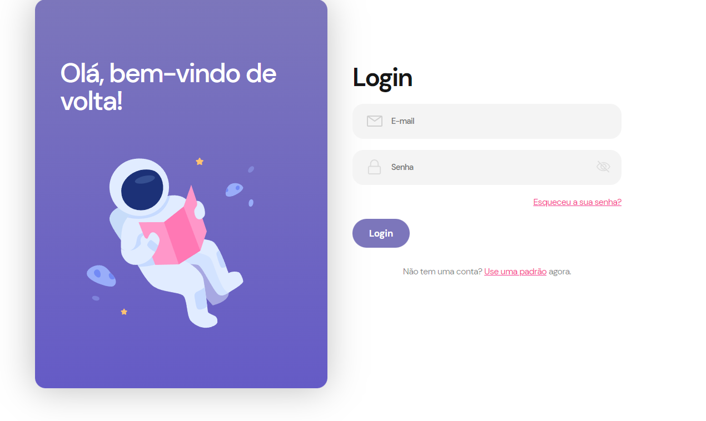

  
<h1 align="center"> Página de login responsiva </h1>

  

## 🚀 Tecnologias

Esse projeto foi desenvolvido com as seguintes tecnologias:

- HTML e CSS
- JavaScript
- Git e Github
- Criação da interface no figma

## 💻 O projeto

A página de login foi um exercício proposto durante o curso 'Desenvolve', realizado pelo grupo 'Oboticario'. O objetivo foi realizar a criação do design de interface  da página e construir a mesma utilizando html e css. 

- [Confira online](https://flavialbraz.github.io/loginpage/login)

Feito com ♥ 
